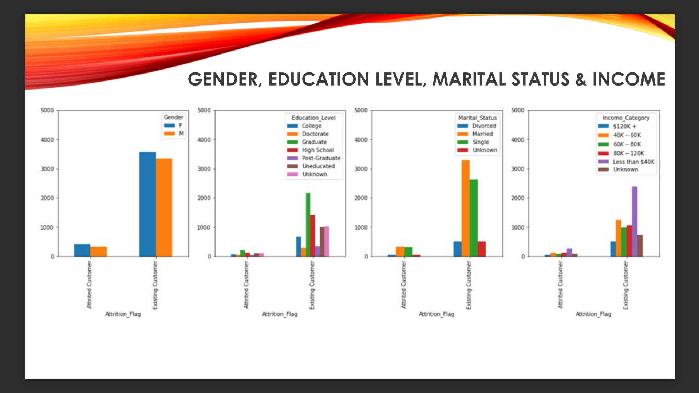
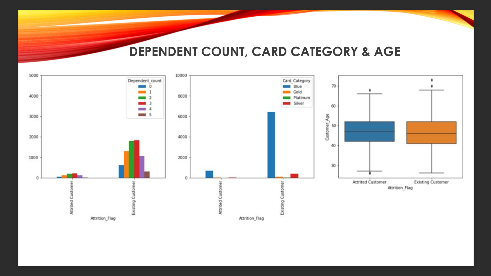
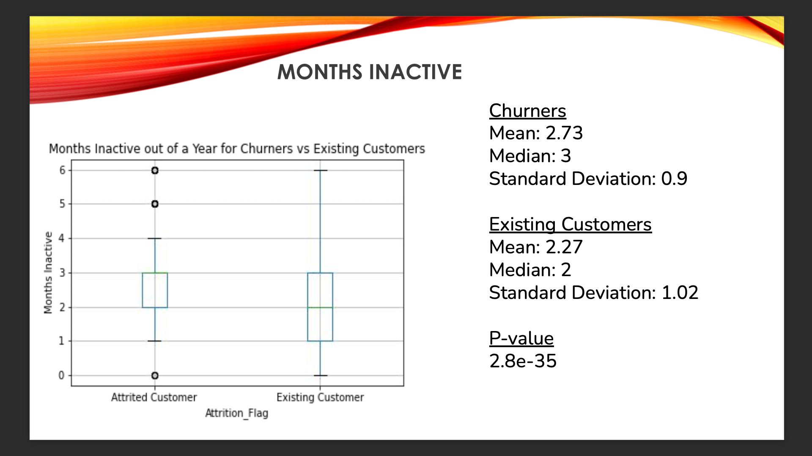
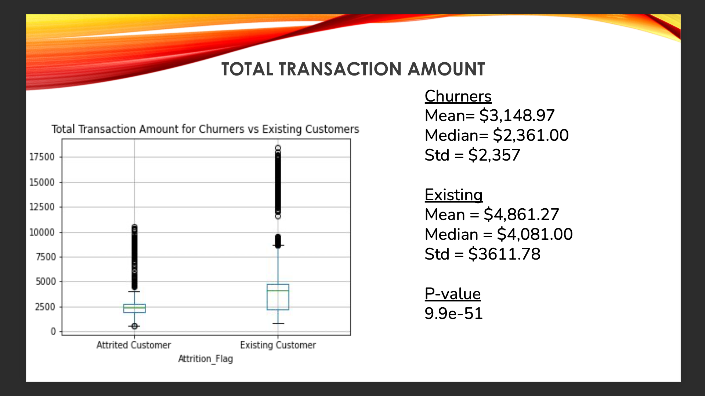
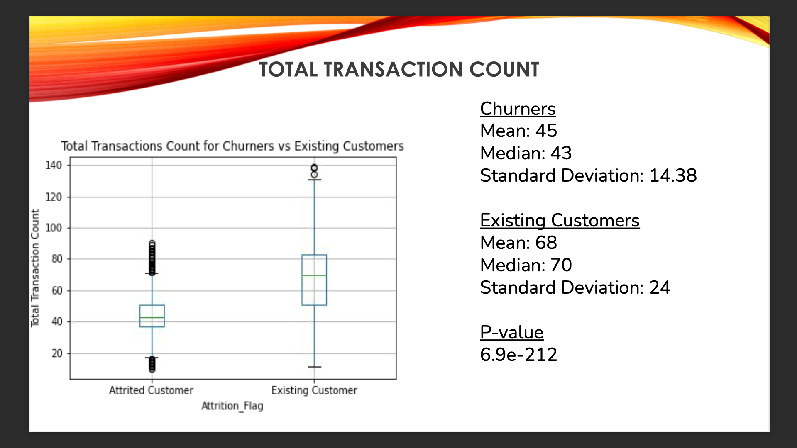
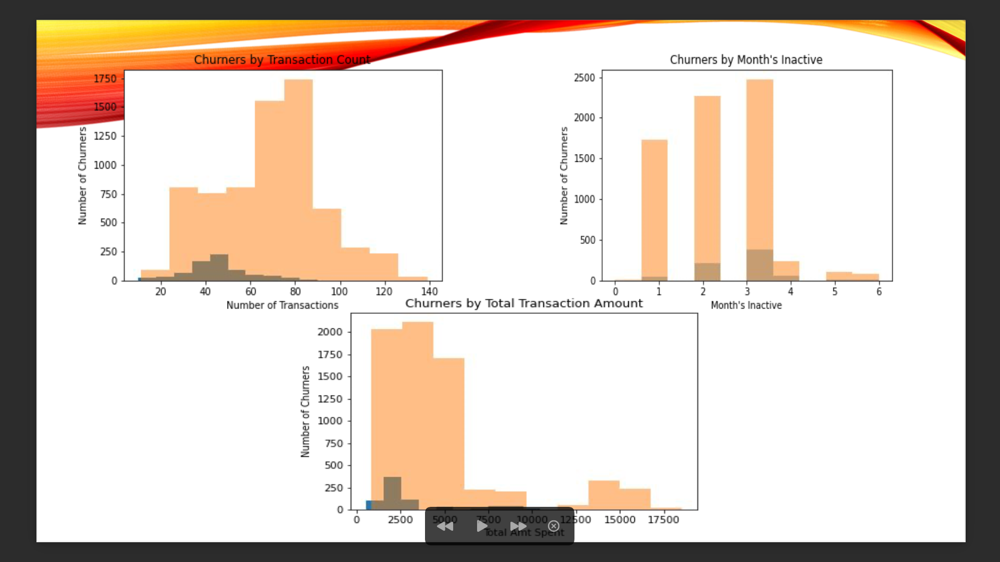

# Bank Churners
  Our objective is to evaluate data to discover trends that may or may not cause people to leave their credit card service. Customer churn is one of the most important and challenging problems for businesses such as Credit Card companies and service providers worldwide, and understanding customer churn metrics can help businesses improve customer retention. Some common reasons for customer churn are; lack of usage of the product, poor service, and ability to find a better price somewhere else. Regardless of the reasoning, it costs more to acquire new customers than it does to retain existing ones. This has a direct impact on operating costs and marketing budgets within the company. Therefore, it is important that one tries to investigate customer churn within a business. Businesses are investing more time and effort in finding out the reasons of churning within their organizations, how they can accurately predict which types of existing customers are at risk to churn, and what actions they can take to minimize  customer churn. Our plan is to go through some consumer data and see how we can leverage data insights and predictive modeling in order to discover trends associating with credit card company churning improve customer retention. 
  
  In our analysis, we used Python, Jupyter Notebook and Matplotlib to organize a large dataset of credit card user data. We analyzed a CSV file (bank_churners.csv) that we found on Kaggle.com. We then cleaned the data by doing things such as removing all customers with a zero utilization ratio and any other extraneous information. We created then created various dataframes and plots in order to better visualize the "profile" of someone who is likely to churn.

  For every column in the dataset, we compared the churner group to the existing customer group, and if the column was categorical in nature we made a bar graph, and if it was quantitative we made a box plot. For the quantitative variables, we also did an independent ttest comparing both groups to see if the dfferences between the groups was statistically significant. 

  Concerning the categorical variables, since all the bar graphs for these variables looked almost identical between the groups, we concluded that none of these variables were truly significant in predicting customer churn. An image of all the bar graphs can be seen below. 

  
  

  For the quantitative variables, we found that only three of these variables had statistically significant differences between the two groups. These variables were months inactive out of 12 months, total transaction amount and total transactin count. Box plots for these variables can be seen below. 

  
  
  

  Logically the results of these plots make sense. Customers who leave are more likely to spend less overall, have less transactions and have longer periods of time when they are inactive.

  After performing analysis for all variables, we decided to come up with our own idea of the "profile" for a customer who is likely to churn would look like. We determined that profile to have two qualities...
  - 51 or less total transactions
  - 3 or more months inactive out the year
  We came up with these using the 0.75 quartile and looking at the histograms for the three statistically significant variables. The reason we did not involve total transaction amount in our profile was because the histogram for that variable did not resemble a normal distribution at all. Below one can see histograms for each of the three relevant variables:

  

